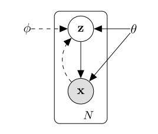
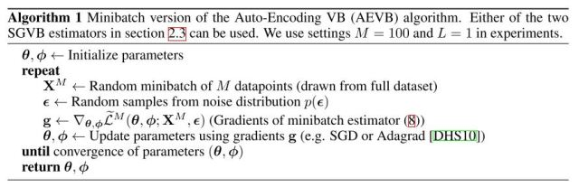
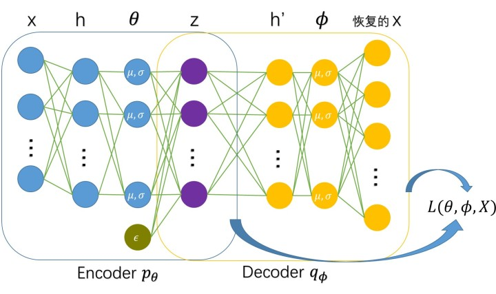
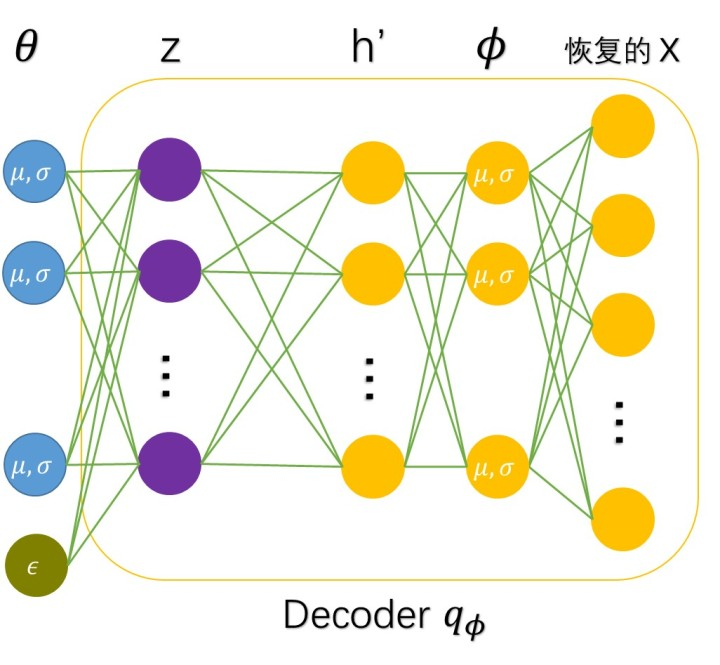
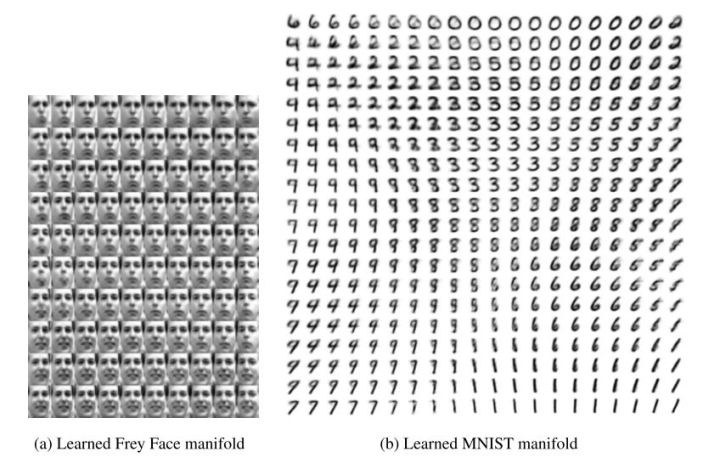
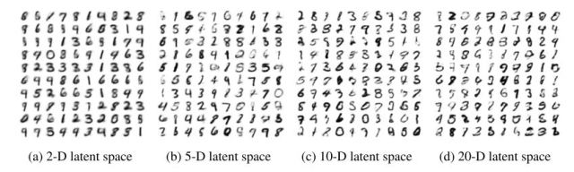

##  VAEs简介

变分自编码器（Variational auto-encoder，VAE）是一类重要的生成模型（generative
model），它于2013年由Diederik P.Kingma和Max Welling提出[1]。2016年Carl
Doersch写了一篇VAEs的tutorial[2]，对VAEs做了更详细的介绍，比文献[1]更易懂。这篇读书笔记基于文献[1]。

除了VAEs，还有一类重要的生成模型GANs（对GANs感兴趣可以去我的微信公众号看介绍文章：学术兴趣小组）。

我们来看一下VAE是怎样设计的。

  

上图是VAE的图模型。我们能观测到的数据是  $\displaystyle \text{x}$  ，而  $\displaystyle \text{x}$
由隐变量  $\displaystyle \text{z}$  产生，由  $\displaystyle \text{z}\rightarrow
\text{x}$  是生成模型  $\displaystyle p_{\theta}(\text{x}|\text{z})$  ，从自编码器（auto-
encoder）的角度来看，就是解码器；而由  $\displaystyle \text{x}\rightarrow \text{z}$
是识别模型（recognition model）  $\displaystyle q_{\phi}(\text{z}|\text{x})$
，类似于自编码器的编码器。

VAEs现在广泛地用于生成图像，当生成模型  $\displaystyle p_{\theta}(\text{x}|\text{z})$
训练好了以后，我们就可以用它来生成图像了。与GANs不同的是，我们是知道图像的密度函数（PDF）的（或者说，是我们设定的），而GANs我们并不知道图像的分布。

  

##  VAEs模型的理论推导

以下的推导参考了文献[1]和[3]，文献[3]是变分推理的课件。

首先，假定所有的数据都是独立同分布的（i.i.d），两个观测不会相互影响。我们要对生成模型  $\displaystyle
p_{\theta}(\text{x}|\text{z})$  做参数估计，利用对数最大似然法，就是要最大化下面的对数似然函数：

$\displaystyle \log
p_{\theta}(\text{x}^{(1)},\text{x}^{(2)},\cdots,\text{x}^{(N)})=\sum_{i=1}^N
\log p_{\theta}(\text{x}^{(i)})$

VAEs用识别模型  $\displaystyle q_{\phi}(\text{z}|\text{x}^{(i)})$  去逼近真实的后验概率
$\displaystyle p_{\theta}(\text{z}|\text{x}^{(i)})$  ，衡量两个分布的相似程度，我们一般采用KL散度，即

$\displaystyle \begin{align}
KL(q_{\phi}(\text{z}|\text{x}^{(i)})||p_{\theta}(\text{z}|\text{x}^{(i)}))&=\mathbb{E}_{q_{\phi}(\text{z}|\text{x}^{(i)})}
\log
\frac{q_{\phi}(\text{z}|\text{x}^{(i)})}{p_{\theta}(\text{z}|\text{x}^{(i)})}\\\
&=\mathbb{E}_{q_{\phi}(\text{z}|\text{x}^{(i)})} \log
\frac{q_{\phi}(\text{z}|\text{x}^{(i)})p_{\theta}(\text{x}^{(i)})}{p_{\theta}(\text{z}|\text{x}^{(i)})p_{\theta}(\text{x}^{(i)})}\\\
&=\mathbb{E}_{q_{\phi}(\text{z}|\text{x}^{(i)})} \log
\frac{q_{\phi}(\text{z}|\text{x}^{(i)})}{p_{\theta}(\text{z},\text{x}^{(i)})}+\mathbb{E}_{q_{\phi}(\text{z}|\text{x}^{(i)})}
\log p_{\theta}(\text{x}^{(i)})\\\
&=\mathbb{E}_{q_{\phi}(\text{z}|\text{x}^{(i)})} \log
\frac{q_{\phi}(\text{z}|\text{x}^{(i)})}{p_{\theta}(\text{z},\text{x}^{(i)})}+\log
p_{\theta}(\text{x}^{(i)}) \end{align}$

于是

$\displaystyle \log
p_{\theta}(\text{x}^{(i)})=KL(q_{\phi}(\text{z}|\text{x}^{(i)}),
p_{\theta}(\text{z}|\text{x}^{(i)}))+\mathcal{L}(\theta,\phi;\text{x}^{(i)})$

其中，

$\displaystyle \begin{align} \mathcal{L}(\theta,\phi;\text{x}^{(i)})& =
-\mathbb{E}_{q_{\phi}(\text{z}|\text{x}^{(i)})} \log
\frac{q_{\phi}(\text{z}|\text{x}^{(i)})}{p_{\theta}(\text{z},\text{x}^{(i)})}\\\
&=\mathbb{E}_{q_{\phi}(\text{z}|\text{x}^{(i)})} \log p_{\theta}(\text{z},
\text{x}^{(i)}) - \mathbb{E}_{q_{\phi}(\text{z}|\text{x}^{(i)})} \log
q_{\phi}(\text{z}|\text{x}^{(i)}) \end{align}$

由于KL散度非负，当两个分布一致时（允许在一个零测集上不一致），KL散度为0。于是  $\displaystyle \log
p_{\theta}(\text{x}^{(i)}) \geq \mathcal{L}(\theta,\phi;\text{x}^{(i)})$  。
$\displaystyle \mathcal{L}(\theta,\phi;\text{x}^{(i)})$  称为对数似然函数的变分下界。

直接优化  $\displaystyle \log p_{\theta}(\text{x}^{(i)})$  是不可行的，因此一般转而优化它的下界
$\displaystyle \mathcal{L}(\theta,\phi;\text{x}^{(i)})$  。对应的，优化对数似然函数转化为优化
$\displaystyle \mathcal{L}(\theta,\phi;\text{X})=\sum_{i=1}^N
\mathcal{L}(\theta,\phi;\text{x}^{(i)})$  。

作者指出，  $\displaystyle \mathcal{L}(\theta,\phi;\text{x}^{(i)})$  对
$\displaystyle \phi$  的梯度方差很大，不适于用于数值计算。为了解决这个问题，假定识别模型  $\displaystyle
q_{\phi}(\text{z}|\text{x})$  可以写成可微函数  $\displaystyle g_{\phi}(\epsilon,
\text{x})$  ，其中，  $\displaystyle \epsilon$  为噪声，  $\displaystyle \epsilon \sim
p(\epsilon)$  。于是，  $\displaystyle \mathcal{L}(\theta,\phi;\text{x}^{(i)})$
可以做如下估计（利用蒙特卡罗方法估计期望）：

$\displaystyle
\mathcal{\tilde{L}}^A(\theta,\phi;\text{x}^{(i)})=\frac{1}{L}\sum_{l=1}^L
[\log p_{\theta}(\text{x}^{(i)}, \text{z}^{(i,l)}) - \log
q_{\phi}(\text{z}^{(i,l)}|\text{x}^{(i)})]$

其中，  $\displaystyle \text{z}^{(i,l)}=g_{\phi}(\epsilon^{(i,l)},
\text{x}^{(i)}), \quad \epsilon^{(i,l)} \sim p(\epsilon)$  。

此外，  $\displaystyle \mathcal{L}(\theta,\phi;\text{x}^{(i)})$  还可以改写为

$\displaystyle
\mathcal{L}(\theta,\phi;\text{x}^{(i)})=-KL(q_{\phi}(\text{z}|\text{x}^{(i)})||p_{\theta}(\text{z}))

+ \mathbb{E}_{q_{\phi}(\text{z}|\text{x}^{(i)})} \log
p_{\theta}(\text{x}^{(i)}|\text{z})$

由此可以得到另外一个估计

$\displaystyle \mathcal{\tilde{L}}^B(\theta, \phi;
\text{x}^{(i)})=-KL(q_{\phi}(\text{z}|\text{x}^{(i)})||p_{\theta}(\text{z}))
+\frac{1}{L} \sum_{l=1}^L \log p_{\theta}(\text{x}^{(i)}|\text{z}^{(i,l)})$

其中，  $\displaystyle \text{z}^{(i,l)}=g_{\phi}(\epsilon^{(i,l)},
\text{x}^{(i)}), \quad \epsilon^{(i,l)} \sim p(\epsilon)$  。

实际试验时，如果样本量  $\displaystyle N$
很大，我们一般采用minibatch的方法进行学习，对数似然函数的下界可以通过minibatch来估计：

$\displaystyle \mathcal{L}(\theta,\phi;\text{X})\simeq \mathcal{\tilde{L}}^M
(\theta,\phi;\text{X}^M)=\frac{N}{M}\sum_{i=1}^M
\mathcal{\tilde{L}}(\theta,\phi;\text{x}^{(i)})$

可以看到，为了计算  $\displaystyle \mathcal{L}(\theta,\phi;\text{X})$  ，我们用了两层估计。当
$\displaystyle M$  较大时，内层估计可以由外层估计来完成，也就是说，取  $\displaystyle L=1$
即可。实际计算中，作者取  $\displaystyle M=100,L=1$  。由上述推导得到AEVB算法：

##  VAEs模型

上面给的AEVB算法是一个算法框架，只有给定了  $\displaystyle \epsilon,
p_{\theta}(\text{x}|\text{z}), q_{\phi}(\text{z}|\text{x}),
p_{\theta}(\text{z})$  分布的形式以及  $\displaystyle g_{\phi}(\epsilon, \text{x})$
，我们才能启动算法。实际应用中，作者取

$\displaystyle \begin{align} p(\epsilon) &= \mathcal{N}(\epsilon;
0,\text{I})\\\ q_{\phi}(\text{z}|\text{x}^{(i)}) &= \mathcal{N}(\text{z};
{\mu}^{(i)}, {\sigma}^{2(i)}\text{I})\\\
p_{\theta}(\text{z})&=\mathcal{N}(\text{z}; 0,\text{I})\\\
g_{\phi}(\epsilon^{(l)}, \text{x}^{(i)}) &= {\mu}^{(i)}+{\sigma}^{(i)}\odot
\epsilon^{(l)} \end{align}$

而  $\displaystyle p_{\theta}(\text{x}|\text{z})$
根据样本是实值还是二元数据进行选择，若样本为二元数据，则选择

$\displaystyle p_{\theta}(x_i|\text{z})=\mathcal{B}(x_i;1,y_i)=y_i^{x_i}\cdot
(1-y_i)^{1-x_i}, \quad i=1,2,\cdots,D_{\text x}(D_{\text x}=\dim(\text{x}))$

若样本是实值数据，则选择

$\displaystyle p_{\theta}(\text{x}^{(i)}|\text{z})=\mathcal{N}(\text{x}^{(i)};
\mu'^{(i)},\sigma'^{2(i)}\text{I})$

实验中，作者选择多层感知器（MLP）对  $\displaystyle p_{\theta}(\text{x}|\text{z}),
q_{\phi}(\text{z}|\text{x})$  进行拟合，具体来说，

对  $\displaystyle p_{\theta}(\text{x}|\text{z})$  ，参数为  $\displaystyle
\theta=(\mu', \sigma')$  ，若样本为二元数据，则

$\displaystyle \begin{align} \log p(\text{x}|\text{z}) &= \sum_{i=1}^{D_\text
x} x_i \log y_i + (1-x_i)\cdot \log (1-y_i)\\\ \text{y}&=\text{sigmoid}(\text
W_2 \tanh(\text W_1\text{z} + \text b_1) + \text b_2) \end{align}$

若样本为实值数据，则

$\displaystyle \begin{align} \mu' &= \text{W}_4\text{h}'+\text{b}_4 \\\
\sigma' &= \text W_5\text{h}' + \text{b}_5\\\ \text{h}' &= \tanh(\text W_3
\text{z} + \text b_3) \end{align}$

对  $\displaystyle q_{\phi}(\text{z}|\text{x})$  ，参数为  $\displaystyle
\phi=(\mu, \sigma)$  ，

$\displaystyle \begin{align} \mu &= \text{W}_7\text{h}+\text{b}_7 \\\ \sigma
&= \text W_8\text{h} + \text{b}_8\\\ \text{h} &= \tanh(\text W_6 \text{x} +
\text b_6) \end{align}$

根据以上假设的分布，不难计算

$\displaystyle \mathcal{L}(\theta,\phi;\text{x}^{(i)}) \simeq
\frac{1}{2}\sum_{j=1}^{D_\text z}(1 + \log ((\sigma_j^{(i)})^2) -
(\mu_j^{(i)})^2 - (\sigma_j^{(i)})^2) + \frac{1}{L}\sum_{l=1}^L \log
p_{\theta}(\text{x}^{(i)} | \text{z}^{(i,l)})$

其中，  $\displaystyle \text{z}^{(i,l)}=\mu^{(i)}+\sigma^{(i)}
\odot\epsilon^{(l)}, \quad \epsilon^{(l)} \sim p(\epsilon)$  。

###loss的推导：
$D_{K L}\left(q_{\phi}(z \mid x)|| p_{\theta}(z)\right), p_{\theta}(z) \sim \mathrm{N}(0,1),$ 下面推导过程将 $\left(q_{\phi}(z \mid x) \text { 简化为 } q\right.$
$D_{K L}\left(q_{\phi}(z \mid x)|| p_{\theta}(z)\right)=\int q(z) \log \frac{q(z)}{p(z)} d z$
$=\int q(z)((\log q(z)-\log p(z)) d z$
$=\int q(z)\left(\log \left(\frac{1}{\sqrt{2 \pi \sigma^{2}}} e^{\frac{(z-\mu)^{2}}{2 \sigma^{2}}}\right)-\log \left(\frac{1}{\sqrt{2 \pi}} e^{\frac{(z)^{2}}{2}}\right)\right.$
$=\int q(z)\left(\log \frac{1}{\sigma}\right) d z+\int \frac{z^{2}}{2} q(z) d z-\int \frac{(z-\mu)^{2}}{2 \sigma^{2}} q(z)$
观察第一项就是常数和概率密度积分求和 观察最后一项，其实就是求方差，因此可以很快得到答案 $\frac{1}{2}$
$=\left(\log \frac{1}{\sigma}\right)+\int \frac{1}{2}(z-\mu+\mu)^{2} q(z) d z-\frac{1}{2}$
$=\left(\log \frac{1}{\sigma}\right)+\frac{1}{2}\left(\int(z-\mu)^{2} q(z) d z+\int \mu^{2} q(z) d z+2 \int(z-\mu)(\mu) d z\right)-\frac{1}{2}$
观察最后一项积分项，是求期望的公式，因此结果为0
综上可以得到结果 $D_{K L}\left(q_{\phi}(z \mid x)|| p_{\theta}(z)\right)=\left(\log \frac{1}{\sigma}\right)+\frac{\sigma^{2}+\mu^{2}}{2}-\frac{1}{2}$
另一项 $E_{z}\left[\log \left(p_{\theta}(x \mid z)\right)\right],$ 是关于x的后验概率的对数似然，在VAE 中并不对decoder做太强的假设，一般通过一个神经网络来得到正态分 布的均值和方差，因此这一项不能通过解析求出，所以采用采样的方式： $E_{z}\left[\log \left(p_{\theta}(x \mid z)\right)\right]=\frac{1}{L} \sum_{j=1}^{L} \log p_{\theta}\left(x^{i} \mid z^{j}\right)$

++++++++++++++++++++++++++++++++++++++++++++++

最后，我们从auto-encoder的角度来理解VAE，下图给出了VAE训练的时候的网络结构（以实值样本为例， **注意下面两个图中的
$\displaystyle \epsilon$  节点并不是bias！而是噪声变量，它的维数与 ** $\displaystyle \text z$
**相同。** ）：

训练好了以后，生成样本采用下面的网络结构：

##  VAE实验效果

作者在Frey
face数据集和MNIST数据集上进行实验，实验得到的数据流形分布如下图所示，可以看出，VAE能够捕捉到图像的结构变化（倾斜角度、圈的位置、形状变化、表情变化等）。这也是VAE的一个好处，它有显式的分布，能够容易地可视化图像的分布。GANs虽然不具有显式的图像分布，但是可以通过对隐变量的插值变化来可视化图像的分布（参见
[ DCGAN
](https://link.zhihu.com/?target=https%3A//mp.weixin.qq.com/s%3F__biz%3DMzIzOTY2NTQ5Mg%3D%3D%26mid%3D2247483910%26idx%3D1%26sn%3Da5b88757993bfbe5564986cd6eb17b46%26chksm%3De927ea3dde50632ba9e3abbdfe53b0bc5425dc9e17324aac5c0e2dec1579555193533d737e2c%23rd)
）。

  

VAE在不同维数的隐变量空间（  $\displaystyle \text z$  ）下生成手写数字的效果如下：

可以看出，采用MLP也能产生效果还不错的数字，有趣的是，隐变量维数较低时，生成的图像笔画清晰，但是带有较大的噪声（模糊）；隐变量维数高时，生成的数字部分笔画不清晰，但噪声小。

##  代码

VAEs网上的代码很多，下面给了三个基于原始论文[1]的代码，作者修改了激活函数和优化方法以取得更好的收敛性。第四个代码是caffe版本，基于文献[2]。

Tensorflow版本： [ y0ast/VAE-TensorFlow: Implementation of a Variational Auto-
Encoder in TensorFlow
](https://link.zhihu.com/?target=https%3A//github.com/y0ast/VAE-TensorFlow)

Torch版本： [ y0ast/VAE-Torch: Implementation of Variational Auto-Encoder in
Torch7 ](https://link.zhihu.com/?target=https%3A//github.com/y0ast/VAE-Torch)

Theano版本： [ y0ast/Variational-Autoencoder: Implementation of a variational
Auto-encoder
](https://link.zhihu.com/?target=https%3A//github.com/y0ast/Variational-
Autoencoder)

Caffe版本： [ Tutorial on Variational Autoencoders
](https://link.zhihu.com/?target=https%3A//github.com/cdoersch/vae_tutorial)

  

##  参考文献

[1]. Kingma D P, Welling M. Auto-Encoding Variational Bayes[J]. stat, 2014,
1050: 10.

[2]. DOERSCH C. Tutorial on Variational Autoencoders[J]. stat, 2016, 1050: 13.

[3]. Blei, David M., "Variational Inference." Lecture from Princeton,  
[ https://www.  cs.princeton.edu/course
s/archive/fall11/cos597C/lectures/variational-inference-i.pdf
](https://link.zhihu.com/?target=https%3A//www.cs.princeton.edu/courses/archive/fall11/cos597C/lectures/variational-
inference-i.pdf) .

